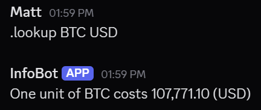
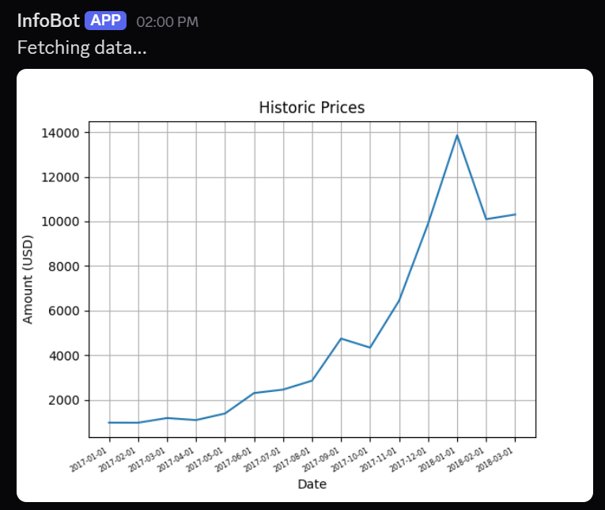

# Info Bot

## Table of Contents

- [About The Project](#about-the-project)
- [Getting Started](#getting-started)
    - [Prerequisites](#prerequisites)
    - [Installation](#installation)
- [Usage](#usage)
    - [Commands](#commands)
- [References](#references)
- [License](#license)

## About The Project

**Info Bot** is a Discord bot that pulls real-time and historical cryptocurrency data using the [Coinbase API](https://docs.cdp.coinbase.com/coinbase-app/docs/track/api-prices). It allows users to look up both current and past crypto prices within a Discord server through simple commands.

**Key features**:
- Look up current prices of cryptocurrencies in various base currencies (e.g. BTC in USD).
- Look up historical cryptocurrency prices over a custom date range.

For details, see [Usage](#usage).

## Getting Started

### Prerequisites
Install Python: https://www.python.org/downloads/

### Installation

1. Clone this repository:
    ```
    git clone https://github.com/Matt1479/Info-Bot
    ```
2. Create a file called `token.txt`, and place your API key inside it.
3. Install Python libraries:
    ```
    pip install -r requirements.txt
    ```
4. Change Git remote URL to avoid accidental pushes to the original repository.
    ```
    git remote set-url origin github_username/https://github.com/Matt1479/Info-Bot
    git remote -v # confirm the changes
    ```

## Usage

- Change directory to `src`:
    ```
    cd src/
    ```
- Run the application:
    ```
    python main.py
    ```

### Commands
- `.lookup crypto base`: Look up (current) price of one `cryptocurrency` in `base currency`, e.g.:
    ```
    .lookup BTC USD
    ```
    This will return the current price of one `BTC` in `USD`.  
    

- `.hlookup crypto base start_year end_year`: Look up historical prices of `cryptocurrency` in `base currency` from `start_year` (YYYY-MM) to `end_year` (YYYY-MM), e.g.:
    ```
    .hlookup BTC USD 2017-01 2018-03
    ```
    This will return `BTC` prices in `USD` from January 2017 to March 2018.  
      
    > Note: Not all base currencies are supported.

## References
- [Discord.py docs](https://discordpy.readthedocs.io/en/stable/#getting-started)
- [Python docs](https://docs.python.org/3/)

## License

This project is licensed under MIT License (see [License](LICENSE.md)).
